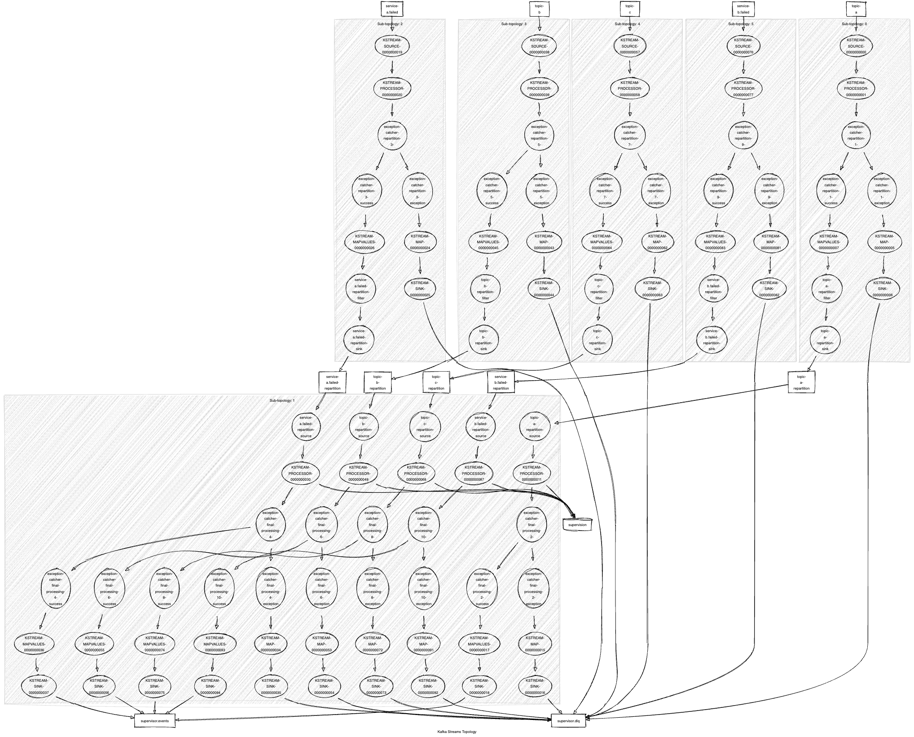

# Kafka Workflow Supervisor

This project is a simple demonstration on how external supervision of a complete workflow using Apache Kafka can be done
with Kafka Streams.
Currently, this supervision is really technical and could be enriched with more business oriented usage.

# Disclaimer

That's just a demo project. :p

Out of order events are not managed yet.

It must be adapted for your use case.

# Compilation

It's a simple maven project. Three things to consider:

- Spring Boot is used for configuration and liveness/readyness ease of use.
- Secrets are encrypted using the [jasypt](https://github.com/ulisesbocchio/jasypt-spring-boot) library.
- Apache Avro Maven plugin is used for Avro schema POJO generation.

# Configuration

An [example of configuration](src/main/resources/application.yml) can be found in the resource director.

# Example of topology

Streams are first repartitioned using the correlation id.
This could be optional if the input topic is already partitioned that way (To be done).

# TODO

- Manage stream exception catcher
- Check Kafka Streams liveness/readyness behavior using actuator
- Optional repartitioning
- Nodes without input/output topics
- Cyclic workflows

